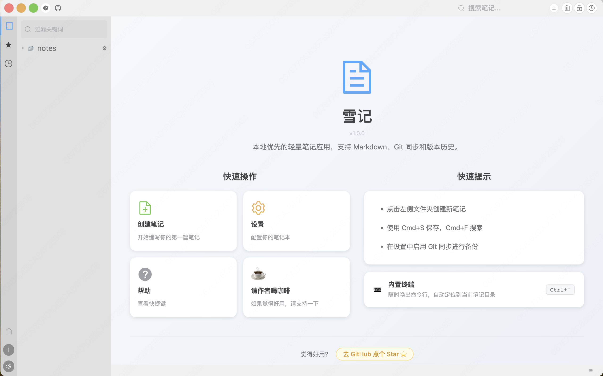

# snowote（雪记）

A lightweight, local-first note-taking app built with Electron and Vue 3. Write in Markdown or rich text, sync with Git, and browse version history — all without leaving your desktop.

[官网](https://snowote.wavesnows.com) · [Download](../../releases) · [Guide](docs/guide.md) · [中文说明](README_CN.md)

---



## Features

- **Dual editor** — Markdown (CodeMirror) or rich text (EditorJS), switch anytime
- **Git sync** — Push/pull to GitHub or Gitee with one click
- **Version history** — Browse git commit history, preview and restore any version
- **Full-text search** — Search across all notes instantly
- **Terminal** — Built-in terminal, auto-navigates to current note's directory
- **Built-in terminal** — Quick access terminal panel (`Ctrl+\``)
- **Favorites & Recent** — Pin, star, and quickly revisit notes
- **i18n** — English and Chinese UI

## Installation

Download the latest installer from [Releases](../../releases):

- macOS: `snowote_x.x.x_arm64.dmg` (Apple Silicon) · `snowote_x.x.x_x64.dmg` (Intel)
- Windows: `snowote_x.x.x.exe`

> **macOS note:** The app is not code-signed. If macOS says the app is damaged, run this in Terminal and try again:
> ```bash
> xattr -cr /Applications/snowote.app
> ```

## Build from Source

```bash
# Requires Node.js >= 14.17.0
npm install
npm run dev      # development
npm run build    # production build
```

## Git Sync Setup

1. Open **Settings → Sync**
2. Select GitHub or Gitee
3. Enter your username, repository name, and personal access token
4. Use the git button in the toolbar or configure auto-sync in **Scheduler**

See [User Guide](docs/user-guide.md) for details.

## Donate

If snowote is useful to you, consider buying me a coffee ☕

<div align="center">
  <table>
    <tr>
      <td align="center">
        <br/>
        <sub><b>WeChat Pay</b></sub>
      </td>
      <td width="40"></td>
      <td align="center">
        <br/>
        <sub><b>Alipay</b></sub>
      </td>
    </tr>
  </table>
</div>

## License

MIT © [wavesnows](LICENSE)
